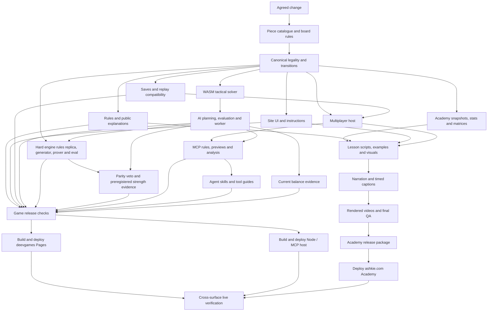

# Muju content and release DAG

Use this when asked to change Muju and “update everything.” A piece-stat change
is complete only when the affected rules, executable behavior, player and agent
explanations, AI, Academy lessons and deployed surfaces agree.

The executable inventory is [`../content-dag.json`](../content-dag.json).
[`../../tools/muju-content-dag.py`](../../tools/muju-content-dag.py) computes its
downstream closure in dependency order. Root [`AGENTS.md`](../../AGENTS.md) makes
this workflow discoverable to agents; [`CLAUDE.md`](../../CLAUDE.md) links it too.

This maps the working tree inspected on 2026-09-18. Hostnames and previous
deployment evidence below are repository records, not a fresh live audit.
Academy text and source are now tracked here: the pipeline scripts, `episode.json`
timelines, Remotion sources, rules snapshots, image prompts and lesson docs under
`muju/academy/` are in the repository. Only rendered media is local-only —
narration and music audio, rendered episodes, posters, thumbnails and QA capture
frames. That media is archived outside git at
`~/Archives/muju-media-2026-09-18/academy` (with `MANIFEST.sha256`); the original
copy is `/Users/ashkie/src/deevgames/muju/academy`. Copy it offsite before
deleting either. An agent in another checkout gets the sources from the commit and
needs the media archive only to re-master or re-render; record media hashes when
handing work off.

## Ask another agent

> Change [piece / rule] to [exact new stats / behavior] and update everything in
> the Muju DAG. Follow `muju/docs/CONTENT_DAG.md`, review every affected node,
> update and verify the current docs, engine, AI, MCP helpers and Academy,
> deploy all affected surfaces, and report source revisions and live evidence.
> Preserve unrelated work and historical artifacts. Explicitly report any
> blocked surface; do not call the change complete while something remains stale.

Omit “deploy” or ask for a prepared release if publication is outside the task.
The DAG guides execution; it does not itself grant credentials or publish anything.

## Generate the work list

Run from the repository root; Python 3.10+ and the standard library suffice:

```sh
python3 tools/muju-content-dag.py check
python3 tools/muju-content-dag.py plan --kind piece-stats
python3 tools/muju-content-dag.py plan --kind rules --format json
python3 tools/muju-content-dag.py plan --files muju/src/game/units.ts
python3 tools/muju-content-dag.py plan --node academy-data --format mermaid
python3 tools/muju-content-dag.py diagram
```

Kinds are `piece-stats`, `rules`, `map-economy`, `ai`, `ai-strength`, `mcp`,
`online`, `ui`, `academy`, and `release`. Repeat `--kind` or `--node` to combine changes.
Use `--kind rules` for new mechanics or uncertain rule scope. File paths are
repository-relative even when running the script from another directory;
absolute paths inside this checkout also work. Include deleted/renamed paths
and use an explicit kind/node if a moved source no longer matches the inventory.

To save a work record, redirect the Markdown plan to a change-specific file in
`muju/docs/changes/` (create that directory if needed), then fill in evidence as
work proceeds. The JSON form carries the same instructions, matching reasons,
commands and pending/blocked status for automation. All planner commands are read-only;
listed commands are instructions for the implementing agent, never auto-executed.

An edge means “review this downstream consumer after changing the upstream
source.” It does not mean every consumer needs an edit. Consumers that import
canonical data often need verification and rebuilding rather than new constants.
The graph describes change propagation and release order, not JavaScript imports;
the engine and WASM wrapper can have mutual runtime relationships without creating
a cycle here.

`check` validates acyclicity, dependencies and required repository paths. Academy
text and source paths are required like any other tracked path; only the Academy
media directories (`production/R??/public/audio/`, `public/music/`, `public/art/`,
`output/`, `qa/`) are declared local-only in the manifest. Unavailable media is
reported, and affected plan nodes are marked **blocked** with the archive location
to obtain (`~/Archives/muju-media-2026-09-18/academy`). Planning remains usable in
a clean checkout; it never drops Academy from the graph. Use
`check --require-local` to require the media too. Missing undeclared repository
paths still fail validation. It does not
prove gameplay, narration or deployed content is correct. Unmapped file inputs
are printed and return exit code 2: investigate them and extend the graph rather
than treating missing coverage as permission to skip work. Known historical
paths are reported separately; current-static outputs are an explicit exception.

## Overview

This condensed view groups nodes for readability. `diagram` emits the complete
27-node graph directly from the JSON inventory.



## Execute an affected closure

1. Inspect checkout status and applicable instructions. Preserve unrelated
   work. Establish intended old/new behavior and rules revision; read the
   canonical definitions and relevant `SPEC.md` sections. Record compatibility
   decisions for existing rooms, saves and replays before release.
   When a whole rule set is added, promoted or retired, also record which rules
   revision every stored room, save, replay, opening corpus and AI strength
   record belongs to; never reinterpret stored state under different rules.
2. Generate a plan by change kind and/or changed paths. Read upstream
   prerequisites even if they are outside the selected closure. Search active
   sources for the piece ID, name, stat labels and old claims to catch consumers
   beyond literal imports. If a newly found surface is missing, add it to the DAG.
3. Work in the emitted order. Give every node one disposition: **changed**,
   **verified unchanged**, or **blocked**, with evidence. A downstream review
   can conclude no edit is necessary, but “imports the table” alone does not
   establish that examples, thresholds or rendered media still agree.
4. Run meaningful changed-rule regressions and the applicable release gates.
   Check generated artifacts, not just source edits. Refresh current evidence;
   historical experiments and old QA logs remain historical.
5. Package and publish each affected target within the user's authorized scope.
   For intentionally unpublished work, report “prepared, not deployed.” An
   unavailable credential or missing external checkout is a specific blocked
   node; finish independent work and identify the remaining dependency.
6. Verify actual changed behavior/content on the live targets and write the
   completion record. An unaffected target can remain at its existing release
   after verifying it contains no changed claims. Do not force redeployment of
   unselected prerequisite branches merely because they meet at the final node.

## Sources, copies and historical evidence

| Surface | Authority / entry point | What tends to get missed |
|---|---|---|
| Rule intent | `SPEC.md`, latest user-approved change; `JUDGMENT_LOG.md` records rationale | Code and prose can disagree; resolve the intended behavior explicitly. |
| Piece data | `src/game/units.ts`, `types.ts`, `elements.ts` | Promotion costs derive from tier cost differences; changing one tier can change two transitions. |
| Executable rules | `src/game/`, `src/ai/simulate.ts`, `src/hooks/useGameState.ts` | Legality, home-checkmate, healing, passive mining and draw timing have downstream assumptions. |
| Site | `src/components/`, hooks, `src/online/` | Instructions, previews and analysis can contain manual prose even when shop stats import correctly. |
| AI | `src/ai/`, `assembly/tactics.ts`, `lab/ai/` | The WASM wrapper packs canonical stats, but the kernel duplicates tactical semantics. Test witness legality and seeded/work-budget reproducibility; wall-clock-limited search need not always return the same move. |
| MCP | `server/observation.ts`, `mcp.ts`, `analysis/`, schemas | The catalogue imports automatically; rule descriptions, analysis assumptions and schema limits do not. |
| Agent guidance | `public/skills/`, `docs/MCP_TOOL_TAPS.md`, `docs/ANALYSIS_TOOLS.md`, `ONLINE.md` | Skills are copied into browser `dist` and served by the Node host too. |
| Hard engine | `src/ai/hard/`, `src/ai/hardOptIn.ts`, `docs/hard-ai/` | A complete second rules engine: `core/state.ts` mirrors transitions and turn boundaries, `tactics/prover.ts` mirrors home defense, and generator grammar, tables and weights encode turn timing and economy. `pack` must reject states it cannot represent. Importing the catalogue updates stats only. |
| AI strength | `lab/hard-ai/`, `tests/ai/hard/`, `tests/lab/`, `docs/hard-ai/RELEASE-*.md` | Strength claims belong to one rules revision. After a rules change re-pin perft, fuzz and goldens, regenerate scripted-bot openings with a fresh sealed split, sanity-gate the baseline, and preregister the rule before the sealed row. Epic run records `docs/hard-ai/e0`–`e5` are historical evidence. |
| Balance | `lab/solver/`, `lab/results/current-static/current.*` | Static value is not AI evaluation. Changed rules invalidate strategic conclusions, not the existence of old experimental records. |
| Academy | `academy/README.md`, `STATUS.md`, active `production/R01`–`R16` | Current `episode.json` and render sources supersede old packets; copied catalogues, matrices, snapshots, narration and finished videos all need separate consideration. |
| Public overview | Root `docs/game-design-dossier.md`, `portfolio/index.html`, `index.html` | The root dossier is copied into the static site; a correct SPEC does not update public summary prose. |

Paths in this table are relative to `muju/` unless labeled root. Dated strategy
guides and reports may mix enduring advice with superseded claims: inspect them
when changing related rules, identify their rules revision, and publish a current
revision or supersession note when needed. Do not falsify prior results by
rewriting their stats to current values. Academy archives, retired strategy
episodes, old `lab/results`, frozen map studies and `outputs/` are evidence,
not regeneration targets.

## Academy propagation details

Start from `academy/README.md` and `academy/STATUS.md`. The published course is 16 lessons, video v7 / rules v2.8. Local Metal v2.9
preparation uses v8 for R05–R06 and R11–R16 and retains the other eight verified v7
lessons; see `academy/STATUS.md`. Inspect the current release before choosing
a new version. The pipeline is source-specific rather than a generic
one-command rebuild.

- `export-rules.ts` imports the live game and writes catalogue, map, full-health
  bonk matrices and rule verification. It checks the v2.8 economy and v2.9 Metal stats and
  writes current JSON only after its assertions pass. Adapt expectations to the
  intended change and require a successful run before propagating outputs.
- Update current `rules-snapshot` and per-episode `source-rules` as appropriate
  after checking imports. Some `types.ts` copies are rendering subsets and some
  provenance notes refer to old snapshots. Record exact source revision/hashes;
  do not mistake a historical provenance string for a verified current copy.
- Active lessons are R01 setup; R02 actions/movement; R03 combat/Cleave;
  R04 mining; R05 purchase; R06 promotion; R07 upkeep; R08 reach; R09 draw;
  R10 complete turn/controls/handicap/clocks; R11 Fire; R12 Lightning;
  R13 Water; R14 Shadow; R15 Plant; R16 Metal. A piece's attack or defense
  can change all six element lessons' incoming/outgoing matrices. Speed,
  mining and cost can also alter examples outside that piece's own lesson.
- Preserve unchanged voice takes and the established cast/music. Update the
  changed-clip inventory used by local transcription, verify speech, realign
  captions and render changed episodes. Inspect temporary Python/model paths
  before running batch scripts. Review actual final frames and audio evidence
  before issuing hash-bound final reviews.
- `revise.py` and `propagate-economy.py` are one-time migrations, not the next
  release recipe. Rerunning them overwrites repaired narration. Retired
  R17–R27 and previous media archives must stay retired/preserved.
- `build-release.py` and `verify-live.py` hardcode release names, versions,
  economy claims and course counts. Update those intentionally. The builder
  explicitly supports the Metal v2.9 mixed release: v8 for R05–R06/R11–R16 and
  verified v7 for unaffected lessons, with per-episode revision and hash checks. Never just
  change the version label on an old export to satisfy the gate.

## Three independent release targets

**Current state (2026-09-18):** Cloudflare Pages publishing is paused, so the Render
host is Muju's canonical and only live-updated release. Treat `static-deploy` as
**blocked (no credentials)** rather than skipped: still build and smoke-test `_site`,
record the block, and verify changed behavior on Render. The Pages hub stays up and
links to Render; Muju links back to the hub with an absolute URL because the Render
root redirects to `/muju/`.

| Target | Package / release instructions | Required live evidence |
|---|---|---|
| Browser games: `https://deevgames.pages.dev/muju/` — **publishing paused; frozen copy, record as blocked** | Root `README.md`, `build-all.sh`, `.github/workflows/deploy.yml`; publish `_site` to Pages project `deevgames`. | Actual deployment step and source revision, fresh page/assets, changed piece/rule, AI worker, save/refresh and public skill copies. The workflow can succeed without publishing if credentials are missing. |
| Online game and MCP: `https://deevgames-muju.onrender.com` | `ONLINE.md`, `Dockerfile`, `compose.yaml`; inspect the current Render service configuration for its release route. | `/api/muju/health`, `/muju/`, `/SKILL.md`, tool discovery and current rules; changed-rule preview/play in a disposable room; persistent rooms survive restart. A Pages deployment does not deploy this host. |
| Academy: `https://ashkie.com/muju-academy/` | Separate `ethancd/ashkie-pages` checkout and workflow; `academy/build-release.py`; website `./check`. Academy text sources are tracked here; the rendered audio and video the builder publishes are local-only and archived at `~/Archives/muju-media-2026-09-18/academy` (`MANIFEST.sha256`), so restore or re-render that media before packaging. | Current page/release manifest, exact media hashes, HTTP range seeking, historical redirects and retired assets; visual check of the live page. Copy the adapted `academy/verify-live.py` to website `tools/verify_muju_videos.py` and run it there, not in `deevgames`. |

Render deployment route verified on 2026-09-18: service `srv-dahbp4ht0dsc73fdqn10`
auto-deploys the GitHub `master` branch using Docker and preserves its existing
1 GB disk mounted at `/app/data`. Verify this configuration again before future
releases; never replace or reset the room database.

The old Academy staging path `/private/tmp/muju-academy-v6-release` is a location
hint, not durable infrastructure. Locate/recreate the correct website checkout
and read its current instructions before changing it. Deployment credentials,
provider configuration and that external repository are not embedded in this DAG.

## Completion record

Use the generated checklist, then add this compact release record:

```text
Change: [exact old -> new behavior]
Rules revision / source commit / dirty-tree provenance: [...]
Affected closure: [planner command and node IDs]
Node dispositions: [changed | verified unchanged | blocked, each with evidence]
Tests and generated reports: [commands, actual outcomes, evidence paths]
Academy impact: [episode IDs, changed claims, export/timeline/audio hashes]
Static release: [revision, deployment URL, live evidence | unchanged/blocked reason]
Node/MCP release: [revision, deployment URL, live evidence | unchanged/blocked reason]
Academy release: [revision, deployment URL, live evidence | unchanged/blocked reason]
Compatibility: [saves, rooms, replay handling]
Remaining work: [none, or exact blockers; prepared is not deployed]
```

## Maintain this map

Add/move node paths and edges whenever a Muju consumer, export, publication
channel or verification gate changes. Add a new change kind if it improves
routing. Keep human instructions in this guide consistent with the JSON.

```sh
python3 tools/muju-content-dag.py check
python3 tools/test-muju-content-dag.py
```

The planner tests verify propagation to required surfaces, dependency order,
multiple-change union, historical exclusions, unknown paths, broken references
and cycle detection. This remains an agent-operated workflow: it neither detects
every semantic dependency automatically nor certifies that someone completed a
checklist merely because the graph is structurally valid.
