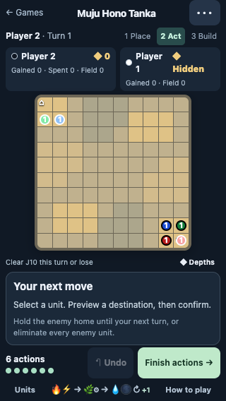

> v1.6 follow-up: [upkeep and inactivity draw](UPKEEP_DRAW-2026-09-08.md) supersede the no-upkeep game lengths, cap rates and carrying values below. Historical measurements are preserved.

> Catalogue/visual-rank numbers superseded by v1.5: [tier-3 cap report](TIER3_CAP-2026-09-08.md). Historical measurements below remain unchanged.

# Home occupation victory: implementation and playtests

> Historical release/report: the later [empty-approaches update](EMPTY_APPROACHES-2026-09-07.md) changes new games to 308 crystals. The measurements below describe the original 340-crystal map.

Implemented 2026-09-07 on `codex/muju-home-victory`. This report describes a tested branch, not a production deployment. The implementation starts at commit `c2fc2bf`, on top of the map-D playtest branch (`5567168`; map-D release `326f043`).

## The rule

**At the start of your turn, if you have a unit on the opponent’s home corner, you win.**

White targets J10 / (9,9); Black targets A1 / (0,0). The check precedes healing, queue advancement, placement and promotion. Entering home is a threat: the defender gets one complete turn to remove the invader. Every element and tier qualifies, including units with zero attack. Elimination still wins immediately. If both players invade, the first qualifying turn start wins.

An invader already blocks all reinforcement rectangles under the existing spawn rules. The defender must use existing units, which can still move, attack and promote. No additional timer, occupancy history, action cost or unit restriction was added. Map D, the 10×10 board and v1.3 unit stats remain fixed.

Home corners have visible markers. The board displays “Clear [home] this turn or lose” for the defender and a hold-until-next-turn message for the invader. Help explains both victories; the victory screen states the actual reason. Saved terminal games preserve that reason. Older unfinished saves adopt the rule at subsequent turn boundaries, without retroactively resolving a mid-turn load.

The search simulator and state reconstruction carry the new terminal result. Evaluation recognizes home wins and adds a heuristic for visible occupation threats. Material-only AI resignation is disabled for the new rule: a material deficit does not establish defeat when a home invasion remains possible. This heuristic update is not a complete strategic retraining of the AI.

## Main finding

**The rule substantially reduced long endings in this scripted suite, while creating a real invasion/defense game. It did not eliminate all stalls or merely formalize positions that were already won.**

The main experiment paired 960 elimination-only runs with 960 home-or-elimination runs using the same seeds, seats and policies:

| Outcome | Elimination only | Home or elimination |
|---|---:|---:|
| Median round counter, including capped games | 52 | 27 |
| Mean round counter, including capped games | 70.35 | 50.21 |
| Games reaching the cap | 438 / 960 (45.6%) | 280 / 960 (29.2%) |
| Median among natural endings only | 25 | 17 |
| Home victories | 0 | 399 |

Seventeen distinct element/tier combinations delivered home victories, covering all six elements and all four tiers somewhere in the sample. This is evidence that the objective is accessible to diverse units, not evidence that every one of the 24 units is equally viable. Lightning I accounted for 106 home wins and Metal IV for 73.

The separate proactive-defense follow-up added 320 runs, 160 per rule. Its median fell from 36 to 22 rounds and capped games from 45 to 24. Total work: **2,240 scripted runs, 1,750,690 actions, zero recorded illegal actions, invariant failures or harness anomalies.**

## Hypotheses, criticism and interpretation

### 1. A breakthrough should finish the game without exterminating a scattered army

Supported in several matchups. Tier-four Metal siege against a reactive Balanced defender fell from a mean 59.5 to 22.5 rounds, with caps falling from 11/40 to 4/40. Against a proactive home guard, the same attacking style fell from 51.5 to 21.9 rounds, with 36 home victories.

This is consistent with the desired shape: accumulate strength, create a breakthrough, then face a final defensive reply. It is not direct measurement of the duration of “mopping up”: the experiment measures total game length and outcomes, and the new objective also changes which positions are winning.

### 2. Cheap Lightning might turn the game into an opening trap

This was the clearest warning. There were 27 home wins by round five in the main suite: 26 by Lightning I and one by Lightning II. Invading Lightning against reactive AntiRush changed from 2 wins and 38 losses to 20–20. A defender that waits until home is occupied can be too late even if it then searches for a clearing sequence.

The follow-up added a policy that stations Water at home in advance while continuing its economy. **None of the 160 new-rule follow-up games ended by home occupation by round five.** Invading Lightning against Guard:InvestT3 finished 7–29, with four capped games. Against Guard:Balanced, however, Lightning still won 29–10, with one cap; that result was essentially unchanged from elimination-only play, and only one game ended by occupation.

Thus guarding home can answer the immediate corner threat without automatically solving the broader rush matchup. These are different policy samples, not a randomized estimate of the isolated effect of guarding. The finding argues against immediately imposing a minimum tier or an extra turn of occupation; it does not prove that Lightning has sufficient counterplay against stronger opponents.

### 3. Durable units should gain an offensive purpose without becoming unkillable

Supported as a mechanism, with a balance warning. Metal IV was an effective finisher, including against guards. Its strong results also existed under elimination rules, so the new condition amplified an already successful scripted strategy rather than independently proving a new imbalance.

Actual game-AI tactical probes cleared Metal IV in both seats using two Fire II attacks. A rules test also demonstrates a three-Water-IV attack rotation that clears it within the six-action budget. These are feasible defensive formations, not guarantees that a defender can afford, position or preserve them in a real game. Corner geometry and blocked reinforcements make preparing the defense strategically significant.

### 4. The rule should preserve options for a materially weaker player

There were 75 main-suite home victories with the winner behind in on-board unit cost; the follow-up added 13. This demonstrates that material advantage alone no longer identifies the winner. It does not establish that these were economic comebacks: the comparison excludes cash, queued units, positional value and earlier advantage.

A promising implication is that fast raiding, diversion, durable invasion, home defense and conventional elimination can coexist. The adversarial concern is compulsory babysitting of a corner: if guarding becomes an invariant opening rather than a meaningful allocation choice, the rule could reduce useful freedom. These scripts cannot settle that question.

### 5. A victory condition alone should not be expected to repair passive play

Confirmed. Balanced self-play and several passive investment pairings remained heavily capped. Aware:InvestT3 versus Aware:Balanced capped in all 40 runs under either rule. Merely recognizing an immediate home threat does not teach a policy to organize an invasion.

The 29.2% main-suite cap rate remains a material limitation. The recommendation is to keep this exact rule as the current prototype, improve longer-horizon invasion and defense in the AI, and test stronger counter-strategies before altering unit stats or adding exceptions. The evidence favors the rule’s ending pressure; it does not certify competitive balance.

## Method and limits

- E13: 24 pairings × 20 seed blocks × two seat assignments × two victory rules = 1,920 runs. The first eight pairings use unchanged legacy policies; the other sixteen probe invasion, reactive defense and Metal siege. Seeds derive from 9071326 plus the pairing index.
- E14: four pairings × 20 seed blocks × two seats × two rules = 320 runs, with seed base 9071426 and proactive guards.
- Both variants in a pair use the same policy, including objective-oriented behavior in the elimination-only control. This isolates the rule under fixed behavior; it is not a comparison of strategies separately optimized for each ruleset.
- `Aware` uses a bounded public-state beam search to clear an occupied home. It considers attacks, useful movement and placement-phase promotions. A failed search is not proof that no defense exists. `Invade` adds forward movement and holds occupied enemy home. `Siege` develops Metal II or IV. `Guard` attempts to station Water at home before invasion. All are lab policies, separate from the production AI.
- The limit is 120 complete rounds or 8,000 actions. The harness records a round-cap position at counter 121. Capped outcomes are kept separate from natural wins; length summaries include those censored runs. No ply-cap anomaly occurred. “Round” is the game counter covering both players’ turns, not one action or one player turn.
- Three self-play pairings have redundant swapped-seat controls: 120 runs in E13 duplicate a deterministic control. Counts are workload counts, not 2,240 independent statistical samples. The per-pair summaries include bootstrap intervals over the 20 seed blocks, with both seats kept together; they do not establish general skill-level confidence intervals.
- This is scripted testing plus four actual-search tactical scenarios, not a full-game tournament of the production AI or human playtesting. It does not establish first-player fairness, optimal play, universal unit viability or the subjective quality of the climax.
- Unit-definition SHA-256 is `7a5fdecdcd77f0dce8c81b0aad357ec439ddcf6f584a7f79f08b212955a2bc43`. All manifests agree. Default board creation uses map D, with 340 crystals. Historical map/static experiments explicitly retain elimination-only rules so their published comparisons do not silently change.

## Verification and evidence

- Production build and TypeScript checks pass.
- All 574 unit/property tests pass across 28 files. New coverage includes both seats, zero-attack eligibility, removal during the reply, automatic queue-to-turn transitions, simultaneous invasions, saved games, elimination controls and coordinated defensive attacks.
- All 19 browser tests pass. The two home scenarios additionally pass after the final help-layout refinement at 320×568 and 390×664. Screenshots were visually inspected for the warning, instructions and victory screen.
- Actual AI at easy/fast cleared Lightning I and Metal IV in both seats: four scenarios, four successes. These probe available tactical replies rather than whole-game strategy.

Main results: [summary](../lab/results/home-victory-2026-09-07/summary.json), [all matchup rows](../lab/results/home-victory-2026-09-07/matchups.md), [AI probes](../lab/results/home-victory-2026-09-07/engine-probes.json), [audit](../lab/results/home-victory-2026-09-07/audit.json).

Guard results: [summary](../lab/results/home-guard-2026-09-07/summary.json), [all matchup rows](../lab/results/home-guard-2026-09-07/matchups.md).

Both result directories include lossless compressed per-game records, selected replays, run manifests and `SHA256SUMS`. E13’s original policy implementation is preserved at `c2fc2bf`; the follow-up adds Guard without changing the previously used policies. Source hashes also cover experiment scripts, so adding a script changes the hash even when gameplay is unchanged.

Reproduce from `muju/` after installing its dependencies:

```sh
# Pass explicit shard indices 0, 1, 2, 3 for the four E13 shards.
node --import tsx lab/experiments/e13-home-victory.ts 20 0 4
# Pass shard indices 0, 1 for the two E14 shards.
node --import tsx lab/experiments/e14-home-guard.ts 20 0 2
python3 lab/experiments/analyze-home.py
python3 lab/experiments/analyze-home.py guard
node --import tsx lab/experiments/home-engine-probes.ts
npx tsc -p lab/experiments/tsconfig-home.json --noEmit
npm test
npm run build
```

Experiment reruns write fresh raw logs in their result directories; run in a separate checkout to preserve the archived evidence. Analysis reads raw logs when present, otherwise compressed logs, so run all shards before regenerating a summary. Mobile verification uses `MUJU_BASE_URL=<served-build-url>/muju/ npm run test:e2e`.


