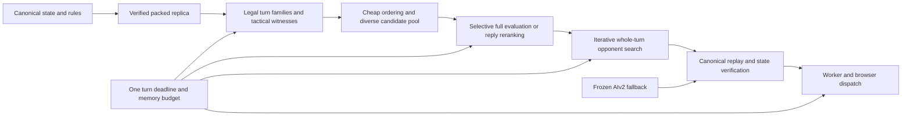
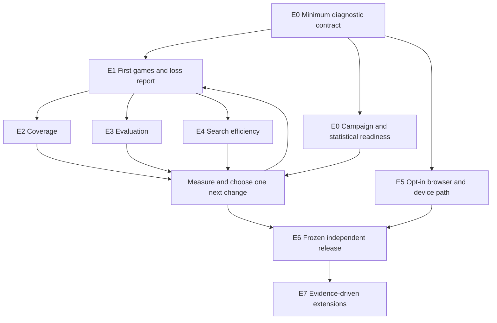

# The Muju Hard AI epic

**Build an opponent that understands Muju's economy, sees complete tactical turns,
and makes the player earn the win—on a phone as well as a desktop.**

Status: proposed execution plan, September 16, 2026. Planning only: no engine
implementation or strength campaign was started while authoring this document.
Baseline inspected: recovery branch `bfe210c`; production `0f1d5f1`.

## The plan in one page

Keep the working foundations: the packed rules replica, legal replay, tactical
witnesses, whole-turn search, and experiment tooling. Put them inside a shorter
feedback loop: **play the shipped Hard AI, explain the losses, change one thing,
and play it again.** The new engine must earn its place against the incumbent.

The first deliverable is an honest strength report, not another search feature.
The first engine priority is discovering where strong turns disappear. In the
current generator, a placement combination represents at most one promotion,
although Muju permits promoting several existing units. More search depth cannot
recover a turn that never enters the candidate set.

| Stage | What becomes true | Decision at the end |
| --- | --- | --- |
| E0 — Trust the contest | Budgets, baseline identity, statistics and evidence are valid | Are the numbers interpretable? |
| E1 — Establish the benchmark | Current Hard has played shipped Hard; losses are classified | Which weakness costs the most games? |
| E2 — See the important turns | Tactical/economic turn families survive generation | Does better coverage improve play at equal time? |
| E3 — Judge positions well | Economy, safety and initiative predict better decisions | Which knowledge earns its computation cost? |
| E4 — Spend time well | The engine completes useful opponent-reply searches | Which search changes earn actual strength? |
| E5 — Make it playable | Opt-in real Hard works in the browser and on real phones | Is it reliable and responsive outside the lab? |
| E6 — Earn the release | Frozen candidate passes an independently checked contract | Ship, keep testing, or reject this candidate |
| E7 — Raise the ceiling | Optional features compete against a strong incumbent | Retain only demonstrated improvements |

E2–E4 are a diagnosis-driven iteration loop, not three compulsory rewrites.
E5 begins early once E0 freezes the timing/protocol contract. E6 is designed at
the start and run throughout in miniature; it is not where strength is first seen.

**Release ambition:** retain the existing desktop comparison against shipped Hard
at 3 seconds per turn, with the existing 0/+100 Elo hypothesis test, plus phone
strength and responsiveness requirements. Passing this hypothesis test does not
prove a universal +100 Elo rating. A larger sustained improvement is welcome,
but no rating or delivery date is promised before measurement.

**Immediate next work:** E0's minimum diagnostic path, then the first two-pair
pilot. Statistical validation, resumability and the phone-contract decision
proceed alongside it. They must not postpone the first descriptive match report.
No books, large training runs, df-pn implementation or pruning bundle before
the direct baseline.

## 1. What “Hard” must mean in this game

Strength means better decisions in Muju's actual strategic situations:

| Muju demands | Behavior we want | Evidence we can inspect |
| --- | --- | --- |
| Four shared actions | Coordinate movement, multiple attackers and Cleave; spend actions on a coherent turn | Canonical action sequences and completed reply search |
| Immediate action after purchasing/promoting | See summon-and-strike, combined purchases/promotions and multiple promotions | Exact small-position coverage witnesses |
| Finite crystal reserves | Expand and relocate before mining stalls; distinguish future income from money already banked | Depletion/relocation cases and economic ablations |
| Recurring upkeep | Finance the next turn and choose a useful army, including forced releases | Upkeep cases and losses attributed to unaffordable plans |
| Healing each turn | Prefer real kills and threats over damage that disappears | Cooperative lethal and false-chip-damage cases |
| Home occupation and spawn geometry | Defend, invade, block spawning and recognize races | Proven home wins/rescues and counterexample replays |
| Ten turns without a kill cause a draw | Seek a draw when losing and avoid accidental draws when winning | Quiet-clock cases, including the ninth quiet turn |
| A person is waiting | Return legal, understandable play within budget; cancel immediately when the game changes | Real browser/phone timing, cancellation and complete games |

The AI receives the same state and obeys the same rules as the human. No hidden
crystal grants, rule changes, or stronger units. An AI that exploits a real rule
is useful evidence about the game; it is not grounds to silently alter the rules.
Unusual human positions and legal legacy-map saves must remain playable.

## 2. What is established, and what is still a hypothesis

The recovery integration passed 1,333 tests across 104 files, production build,
server/hard-AI types and dependency checks. The original project reported a
million differential actions without divergence; that is historical evidence,
not a fresh million-action run of every future patch. No direct competitive
result against shipped Hard has yet established replacement strength.

The planning reviews identified these concrete blockers:

| Finding | Consequence | First owner |
| --- | --- | --- |
| Both `lab/hard-ai/bots/hard.ts` and the recovery `src/hooks/useAI.ts` can request the original allowance again on a re-search | Equal nominal budgets can spend unequal total time | E0.2 |
| `ladder/elo.ts` duplicates each pair mean and counts the copies as separate games for uncertainty | Reported intervals are too narrow under the pair model | E0.3 |
| M19's phone row asks for H1 with hypotheses 0 and 0 | Its LLR is always zero; the stated gate is impossible | E0.6 |
| SPRT is evaluated after all shards finish; `--profile` is only recorded in the manifest | Advertised early stopping and physical phone simulation are absent | E0.3/E0.4 |
| Hard's `setSeed` is a no-op; ladder workers start at the canonical initial state and disable replay recording | Repeated seed-only hard-v-hard games need not provide independent variety or useful loss evidence | E0.4 |
| M19 expects unsupported/missing pieces including `hard@ship`, `p95TurnMs` and `seatMirrored`; M19/M20 gates are stubs | The old campaign command is a specification, not a runnable release recipe | E0.6 |
| `gen/generate.ts` combines purchases with at most one promotion | A legal family is absent in both narrow and reference generation | E2.1 |
| The reference is K=2000 with its own 120,000-node cap, not K=96 and not exhaustive | Relative recall can miss shared blind spots | E1.3/E2.1 |
| Stage 0+1 scores candidates before truncation; richer stage-2 features arrive later | Useful economic/safety knowledge may arrive after the relevant turn was discarded | E2.3 hypothesis |
| The worker rejects `engine: 'hard'`; current mobile E2E uses Chromium with a phone viewport | Protocol types and a narrow screen do not establish real Hard integration or phone performance | E5 |

These are code-review findings, not new measured strength results. E0/E2 add
reproducers before changing the implicated behavior. The 58 feature weights are
hand-authored priors; their number is not evidence that evaluation is good.

## 3. Architecture: keep the foundation, make choices earn their place

Use whole-turn search over the verified replica as the leading candidate. It
matches Muju's shared-action structure and collapses equivalent orderings into
distinct end states. Keep shipped AIv2 as the frozen opponent, fallback, and a
possible source of candidate turns. The architecture remains revisable if the
contest says a simpler path is stronger.



No single heuristic vetoes a proved immediate win or required home rescue. Pruned
families must be visible in diagnostics. A complete legal fallback must be ready
before expensive search, and every request shares the remaining turn allowance.
An engine failure is counted and diagnosable even if the player gets a graceful
fallback. Cancellation never dispatches a stale plan.

We will measure whether the bottleneck is **representation**, **shortlisting**,
**evaluation**, **reply search**, or **time allocation**. This avoids treating
every weak move as a reason to add a new feature.

## 4. Epics and executable work slices

Each row is a bounded work item, not a promise that it fits exactly one hour.
Aim for 30–90 minutes of implementation with at most five substantive acceptance
clauses. If the work exceeds that, checkpoint and split it; do not weaken its bar.
Long campaigns are separately scheduled jobs, never hidden inside an implementation
estimate. Paths below are relative to `muju/`.

### E0 — Trust the contest

Owners: measurement lead, integration lead, independent statistical reviewer.
Dependencies: current recovery checkpoint. No new search features.

| Slice | Deliverable | Acceptance evidence |
| --- | --- | --- |
| E0.1 Baseline identity | Freeze production AIv2 and current Hard, their sources, dependencies, WASM and complete resolved configs | Adapter lifecycle, seeds, resignation and action allocation match the released worker; a changed-turn AIv2 arm has its own identity |
| E0.2 One turn allowance | Shared accounting in lab adapter and browser hook; explicit fallback/re-search policy | Forced partial-plan, phase-crossing and retry cases cannot reset the allowance; report total elapsed time including packing/tables/startup as well as search time |
| E0.3 Statistical validity | Pair-aware intervals and independently validated sequential test; strict parameter validation | Known reference cases and simulated null/alternative/zero-variance cases; reject equal hypotheses; no green result from tiny degenerate samples |
| E0.4 Evidence runner | Opening-position input, trace/replay support, full config hashes, robust manifests and resumable pair records | Same opening is played with engine seats exchanged; no duplicate pair IDs on resume; preserve partial runs and counters; failed/divergent games are never silently dropped |
| E0.5 Resource and timing probe | A single heavy-work queue, explicit engine-test timeouts, cold/warm latency and memory sampling | Two-worker global cap; no simultaneous benchmark/build load; actual device and load recorded; 2-pair forecast before campaign launch |
| E0.6 Release-contract repair | Resolve every unsupported M19 field/arm and the impossible phone statistic; short amendment record | Reviewer checks mechanics; owner accepts any requirement change before release testing; exact commands and produced metrics agree |

Files: `lab/hard-ai/ladder/{engines,run,worker,pairing,elo,sprt,shard}.ts`,
`lab/hard-ai/bots/hard.ts`, `src/hooks/useAI.ts`, worker protocol/client, and
focused ladder/worker tests. E0.2 has one owner across shared files.

**Exit:** a small legal replayable contest with trustworthy timing and uncertainty.
The release-contract decision may remain pending without blocking diagnostic
measurements; it blocks declaring release readiness.

**Minimum path to the first games:** baseline identity, conserved turn allowance,
canonical legal replay/recorded actions, and a manually enforced resource cap.
After those checks, run E1.1 and publish raw paired scores and failure evidence.
Do not wait for a general scheduler, resume system or validated SPRT. Label this
early report descriptive; do not attach unvalidated Elo intervals or claim
independent opening coverage. Finish E0.3–E0.5 before inferential campaigns.

### E1 — Establish the benchmark and explain the losses

Owner: measurement lead, with an independent replay analyst. The first pilot
depends on E0's minimum path; inferential campaigns depend on E0.1–E0.5.

| Slice | Deliverable | Acceptance evidence |
| --- | --- | --- |
| E1.1 First direct contest | Current Hard vs frozen shipped Hard at 3,000 ms per turn | Two pairs per handicap, then eight additional pairs per handicap; actual timing, W/D/L, pair counts, replay, fallback and adjudication attached |
| E1.2 Muju examination set | Small versioned tactical/economic corpus from authored cases and real losses | Every exact case has a canonical witness; strategic preferences are labeled judgments; entire games/opening families split into development, validation and sealed acceptance sets |
| E1.3 Controlled ablations | Explicit K=24/96, action-width, placement-width and scoring variants | One factor changes per arm; full configurations recorded; reference generation is labeled selective; compare diagnostic quality and equal-time games |
| E1.4 Decision report | One page: strongest candidate, dominant failure class, proposed next patch | Include representative wins/losses and an inconclusive category; no architecture decision based only on eight pairs or Rush results |

Baseline campaign after the pilot: plan for 50 pairs per handicap (200 games
total), subject to the observed variance/runtime forecast. This is diagnosis,
not automatic release certification. Use canonical initial games as a product
check and a diverse frozen opening set for generalization; report those strata
separately. Freeze their allocation before the full sample; exclude the earlier
pilot/diagnostic pairs from that preregistered sample. Do not manufacture variety
through unreachable or silently rebalanced
positions. A seed change that produces an identical trajectory adds no opening
coverage.

Classify losses at the first consequential decision: candidate absent; strong
candidate discarded; strong candidate misjudged; reply missed; clock/fallback;
or genuinely unclear. A deeper selective search is an adviser, not an exact oracle.

**Exit:** a direct baseline, a cost estimate, and one chosen improvement hypothesis.

### E2 — See the important turns

Owner: generator lead. Start after E1 has frozen the baseline; corpus auditing can
proceed alongside E1. This is the leading priority, not a predeclared explanation
of every loss.

| Slice | Deliverable | Acceptance evidence |
| --- | --- | --- |
| E2.1 Representation audit | Enumerate which legal turn families the generator can express; address multi-promotion combinations | Small affordable positions compare against canonical enumeration; canonical witness for multi-promotion, purchase+promotion, upkeep and summon-and-strike cases |
| E2.2 Coverage instrumentation | Trace family → placement shortlist → action beam → final K → search choice | For each known strong turn, identify the stage that removed it; report missing families, retained end states and bounded-reference regret |
| E2.3 Root breadth experiment | Compare wider K, wider action beam, more placement plans, and selective stage-2/reply reranking separately | Show the recovered choice and its cost; retain only useful diagnostic gains that survive an equal-time contest |
| E2.4 Adaptive candidate selection | If justified, reserve distinct tactical/strategic plans or progressively widen promising root choices | Exact witnesses remain protected; diverse end states rather than cosmetic action permutations; held-out improvement without latency/correctness regression |

Files: `src/ai/hard/gen/*`, `engine.ts` scoring callbacks, `config.ts`,
`lab/hard-ai/recall/*`, tactical suites. Multi-promotion support must respect
joint affordability, one promotion per unit, newly purchased-unit restrictions,
and the tier-3 cap; simply concatenating individually legal promotions is unsafe.

Potential experiment: inject canonical-legal AIv2 proposals into the root pool.
It provides a useful control: if an old-engine move wins when supplied, investigate
generation; if it is supplied and rejected, investigate evaluation/reply search.
Its compute cost counts against the same budget.

**Exit:** important tactical families are represented; the selected coverage change
improves choices and has measured match evidence. A larger K by itself is not success.

### E3 — Judge positions well

Owner: evaluation lead. Depends on E1's corpus and stable generator configuration.
Run experiments separately from E2 changes so effects remain attributable.

| Slice | Deliverable | Acceptance evidence |
| --- | --- | --- |
| E3.1 Feature audit | Expose feature contributions, scale and cost; ablate material/economy/home/safety groups | Check double counting, side symmetry and healing/quiet-clock semantics; distinguish contradictory authored preferences from engine bugs |
| E3.2 Fix one costly misconception | Improve the loss-dominant concept: e.g. depletion/relocation, promotion liquidity, rent, home defense or spawn denial | Reproduce the error, correct it on a development case, and assess unseen cases plus unchanged match opponents |
| E3.3 Small tuning experiment | Tune a limited parameter block only after feature meanings stabilize | Separate training/validation games; no acceptance-set leakage; better fit must survive equal-time games and tactical non-regression |

Files: `src/ai/hard/eval/*`, relevant `tables/*`, and a bounded
`lab/hard-ai/tune/*` experiment. Crystal bank, projected mining and finite reserves
must not count the same future resources three times. Do not turn every strategic
preference into a universal invariant or “repair” a fixture because the engine loses it.

**Exit:** simpler or better-calibrated judgment that earns strength. Adding features
or lowering training loss without better play is insufficient.

### E4 — Spend time on useful replies

Owner: search/performance lead. Depends on E1 and a pinned candidate/evaluator.

| Slice | Deliverable | Acceptance evidence |
| --- | --- | --- |
| E4.1 Cost and completion profile | Attribute time to generation, tables, evaluation, reply search and quiescence | Report completed iterations and opponent coverage, not only peak depth or nodes/s; include difficult and depleted positions |
| E4.2 Search safety audit | Check TT state identity/bounds, terminal ordering, stand-pat and truncation behavior | Agreement with tractable full-width reference searches; forced home defense, upkeep and imminent draws included |
| E4.3 One measured improvement | Optimize the dominant cost or enable one ordering/aspiration/reduction/extension idea | Same-time challenger contest; retain tactical exemptions; revert a failed improvement rather than stacking another on it |

Files: `src/ai/hard/search/*`, `tables/context.ts`, `engine.ts`, profiling tools.
Do not import chess assumptions without Muju counterexamples: actions share a
turn, purchases precede attacks, and a compulsory home rescue makes a quiet
evaluation unreliable. Begin with fewer unsafe assumptions before adding pruning.
WASM optimization is justified only for a measured hot path after correctness and
algorithmic usefulness are established.

**Exit:** more useful completed reasoning within the same time and memory budget.

### E5 — Make real Hard playable early

Owner: integration/browser lead. Starts after E0.1/E0.2 freeze baseline/protocol;
can overlap E1 and engine experiments in a separate worktree.

| Slice | Deliverable | Acceptance evidence |
| --- | --- | --- |
| E5.1 Opt-in worker route | Real `HardEngine` requests behind a development flag; canonical replay and fallback | Browser test proves Hard actually ran; pack error, invalid suffix and worker failure are observable and recover legally within remaining budget |
| E5.2 Race and lifecycle safety | Request identity, cancellation, restart/undo/load protection and bounded context lifetime | No stale dispatch after any state change; repeated starts/cancellations do not leak contexts or leave Thinking stuck |
| E5.3 Device profiles | Measured calibration, memory limits and time allocation | Desktop browser matrix plus actual iPhone Safari and Android Chrome; record cold start, sustained games, latency tails and memory behavior |
| E5.4 Human review | Playtest tactical sharpness, strategic variety and waiting experience | Review reproducible games; capture specific frustrations as cases; Easy/Medium, saves, replay and analysis remain functional |

Files: worker protocol/handler/client, `src/hooks/useAI.ts`, development flag,
`e2e/hard-ai.spec.ts`, device harness. A phone viewport tests layout. WebKit
automation tests an engine family. Neither substitutes for real-device latency,
thermal behavior or memory pressure. If hardware is unavailable, record the phone
gate as unverified; do not relabel a desktop run.

Track search time and end-to-end turn duration separately, including the existing
per-action animation delay. Keep the old production path selectable and avoid
quietly changing Easy/Medium through shared whole-turn plumbing.

**Exit:** complete games using actual Hard, including failures and cancellations,
with a measured user experience. The public default remains unchanged.

### E6 — Earn and verify the release

Owners: coordinator and independent verifier. Depends on approved E0.6 contract,
the selected E2–E4 candidate, and E5 device evidence.

| Slice | Deliverable | Acceptance evidence |
| --- | --- | --- |
| E6.1 Assemble and freeze production candidate | Focused PR from current master, then exact source/config/WASM/weights/optional-book hashes and held-out test contract | Qualify the code that will deploy; no dirty tree or acceptance-set tuning; correctness, strength and responsiveness reported separately |
| E6.2 Run release contract | Desktop and phone contest plus full affected correctness/browser checks | Pass every required row, including zero replica divergences; fail or inconclusive stays unshipped; independent replay/statistics review |
| E6.3 Controlled promotion | Merge the qualified production candidate; deploy from master; retain rollback | Prove final runtime/config/assets equal the qualified candidate; any functional difference requires relevant requalification; verify live SHA and actual Hard play |

An opt-in build may precede release qualification. Calling it the new default
Hard may not. Do not merge the entire research branch and its artifact history
blindly into production: assemble the focused implementation PR before final
qualification, including required runtime/test assets and the research provenance.
After merge, check the runtime diff and rerun the relevant regression/browser
checks. A changed fallback, hook, config, rules module or WASM cannot inherit a
different artifact's strength qualification without review and affected retesting.
Local debug measurements are sufficient; no new player telemetry service is part
of this plan. Release monitoring uses existing logs and deliberate smoke games.

**Exit:** a stronger tested opponent is actually available to players, with a known
rollback revision and a concise release report.

### E7 — Raise the ceiling only where evidence points

Optional follow-on work, not prerequisites to E6:

- df-pn home-force search if ordinary search repeatedly misses short forcing wins.
- Opening books if strong play exists without them and startup/repeated openings
  remain a measured problem. Version books by rules, map, handicap and engine;
  test book-off strength and off-book recovery.
- Wider parameter optimization after a small tuning run demonstrates payoff.
- A compact learned evaluator/policy only after a data-quality and inference-cost
  spike beats the hand-designed alternative on held-out equal-time play.
- An alternative action-level search/MCTS prototype only if the whole-turn
  bottleneck persists after coverage fixes. Use the same contest and budget.

Every feature is independently switchable and competes against the current
champion. A technically elegant module may remain disabled. Difficulty presets
can later share a proven engine, but that is a separate product decision.

## 5. The experiment contract

There are three different kinds of evidence; never substitute one for another.

| Evidence | Budget | What it establishes |
| --- | --- | --- |
| Correctness and deterministic diagnostics | Fixed work, canonical fixtures, bounded enumeration | Rules agreement, reproducibility, where choices disappear |
| Development strength | Equal actual turn-time policy, diverse paired openings | Whether a patch is promising under a controlled comparison |
| Release strength and experience | Frozen candidate; preregistered statistics; real device profiles | Whether the shipped replacement meets the approved contract |

### Campaigns in order

1. **Plumbing pilot:** two mirrored pairs per arm and handicap, then eight
   additional diagnostic pairs per arm and handicap; record actual cost, faults
   and duplication. Start with the shipped-Hard comparison; do not fan out every
   ablation. This is a bug detector and forecast, not a strength claim.
2. **Baseline:** current Hard vs shipped Hard at 3,000 ms/turn, h0 and h3;
   start from the 50-pairs-per-handicap diagnostic plan. Shipped Hard vs Rush at
   500 ms, eight pairs, h0 calibrates the historical smoke result only.
3. **Coverage diagnostics:** K-only 24→96; action-width-only; placement breadth;
   full-evaluation/reply reranking. Use tractable positions at generous diagnostic
   budgets to locate quality loss, then equal-time matches to price the improvement.
4. **Champion/challenger iteration:** small standing report after each substantive
   candidate; a preregistered confirmation before claiming a new champion. Track
   comparisons with both incumbent production and the last accepted candidate.
5. **Held-out release:** fresh acceptance openings/games, fixed source and config,
   approved stopping rules, device and robustness checks.

Report game score, W/D/L, number of independent pairs/opening families, interval,
Elo transform, results by handicap/seat/start-position stratum, game length,
adjudications, illegal actions, divergence/fallback counts, cold/warm latency,
actual per-turn time, completed depth and peak memory. A point estimate without
its sample and uncertainty is not a result. Natural ten-quiet-turn draws are
game outcomes; harness turn-limit adjudications are a different statistic.

Equal time means a common enforced whole-turn deadline policy, with all engine
work, re-search and fallback charged to it. Report startup/packing/verification
overhead separately and within total elapsed time. Freeze the watchdog-overrun
tolerance and violation handling from an initial engineering probe before the
contest; a noncomparable run is invalid. Do not retroactively select games or
adjust an engine's budget to equalize favorable observed results.

Use full five-category paired outcomes for the sequential model and pair-aware
uncertainty. If multiple runs reuse an opening, account for that clustering;
do not count copies as independent samples. Preserve actual outcomes and replay
provenance. Handle all-draw/all-win samples without artificial near-certainty.

Choose either a valid sequential design with ordered pair checkpoints and
predeclared boundaries, or a fixed sample with a preregistered interval/decision.
Implement the former before advertising early stopping. Repeatedly inspecting
a fixed-sample confidence interval and stopping when it looks good is not valid
sequential testing. A cap reached without a decision means inconclusive. Correct
for the intended family of release claims; exploratory patch selection must be
followed by fresh confirmation. Never rerun fresh seeds until one passes.

The official Stockfish Fishtest code offers a useful independent reference for
[paired likelihood calculations](https://github.com/official-stockfish/fishtest/blob/master/server/fishtest/stats/LLRcalc.py)
and [score/Elo uncertainty](https://github.com/official-stockfish/fishtest/blob/master/server/fishtest/stats/stat_util.py).
Its [early-stopping discussion](https://github.com/official-stockfish/fishtest/issues/2125)
also illustrates why changing stopping rules changes error guarantees. Validate
Muju's implementation against pinned reference cases and simulations; do not assume
that borrowing the SPRT name establishes statistical validity or game strength.

### Release requirements: preserve intent, explicitly repair mechanics

| Requirement | Inherited contract | Status in this plan |
| --- | --- | --- |
| Desktop strength | Hard vs shipped Hard, wall:3000, h0/h3, 300 total pairs cap; SPRT 0/+100, alpha=beta=.05; H1 required | Preserve the strength objective; validate the statistical implementation and report handicap strata |
| Turn-path calibration | AIv2-turn vs AIv2, wall:3000, h0, 150 pairs cap; 0/+50, not-H0 | Report separately; “not-H0” includes inconclusive and is not proof of improvement |
| Phone strength | Hard mobile vs shipped Medium, wall:1500, h0, 200 pairs cap; current 0/0 test requires H1 | Invalid mechanics; owner decision required before release campaign |
| Responsiveness | Phone p95 ≤3,000 ms; desktop p95 ≤6,000 ms; phone depth-1 ≤150 ms across corpus | Remain mandatory gates, currently unverified; freeze metric accounting and separately report end-to-end duration |
| Correctness | Zero illegal actions and replica divergences; canonical checks; suites no worse than M14; adjudication ≤1% | Hard vetoes; freeze fixture versions so an easier suite cannot manufacture a pass |
| Deferred M14 obligations | Invariants ≥.90; Rush smoke Elo ≥0 at wall:500 | Remain mandatory for their owning M18 gate unless amended; their relation to release must be explicit, never inferred as waived |

E0.6 produces an exhaustive signed-off inventory: release blocker, owning
milestone requirement, or diagnostic, with metric scope and approval provenance.
Until then, no inherited requirement is relaxed by wording in this plan.

**M20 is retained where applicable.** Small development experiments do not waive
its feature-activation contract: independent mirrored h0/h3 comparisons at fixed
400,000 work, SPRT 0/+10 Elo, alpha=beta=.05, 1,500-pair cap, and H1 before enabling
tuned weights/df-pn/search flags. The book's concrete command instead uses
wall:3000 and 300 pairs. A defined decision or `dfpn != H0` can complete a report
but cannot enable an inconclusive feature. Equal-time confirmation is also needed
for a product-strength claim. The full Texel/corpus obligations remain part of
M20; replacing that campaign with a smaller staged alternative requires an
explicit amendment. Optional M20 work need not block an otherwise qualified M19
release, but incomplete features cannot ride along as defaults.

**Proposed phone repair:** if the intended claim is “at least as strong as Medium,”
choose a meaningful non-inferiority margin before results (for example −25 Elo,
as an explicit product tradeoff), then use a validated one-sided design. If the
intended claim is “stronger than Medium,” use distinct superiority hypotheses
such as 0/+50. These are proposals, not approved amendments or two gates from
which an implementer may choose after seeing scores. Retain the real-device time
requirement in either case. This plan does not edit `MILESTONES.md` or its criteria.

Add a same-budget phone comparison against shipped Hard as a diagnostic for the
product ambition; upgrading it to a release requirement is a separate explicit
decision. Do not hide a phone regression behind a desktop aggregate. Hardware
selection and memory/cancellation limits are frozen in E0.6/E5 from an initial
device spike, before final testing—not invented as already-proven constants.

## 6. Work organization and resource budget



Parallelize independent understanding, implementation and review, not competing
edits to a shared search/config file. Use up to three working lanes: engine,
measurement, and browser integration; coordinator owns integration, shared config
and experiment scheduling. A verifier may review another lane but never approve
their own implementation or criterion amendment. Each lane gets an isolated
worktree and explicit file ownership. Runtime build outputs are not shared.

Cap **all heavy test/benchmark child processes combined at two** on this shared
machine. A coordinator-held queue must account for nested shards. Serialize
performance campaigns against builds and other heavy tests. Increase concurrency
only after measuring throughput and timing stability; process count is not the
same as useful progress. Do not terminate unrelated user sessions to gain capacity.

Use bounded effort allocations rather than an invented completion date:

| Investment | Budget rule | Stop/checkpoint condition |
| --- | --- | --- |
| First implementation slice | 30–90 focused minutes | Emit a reviewed result or split a concrete blocker |
| Measurement preparation | E0 cards individually sized; reassess after the first two | Do not start bulk games with unresolved identity/timing/statistics defects |
| First strength work | One change and one paired experiment at a time | No two feature iterations without updating the shipped-Hard comparison |
| Long campaigns | Pilot-derived cost, explicit pair/time/disk cap | Save completed pairs and report inconclusive when capped |
| New architectural feature | Small falsifiable spike before implementation epic | Stop if it cannot beat the simpler control on the chosen evidence |

Estimate runtime from completed pilot games: approximately
`2 × pairs × meanGameSeconds / concurrentGameWorkers`, plus measured overhead.
Compute separately for each handicap and opening stratum, using both typical and
slow-game estimates. At 50 pairs per handicap for two handicaps, that is 200 games,
not 100. A 10-Elo optimization can need far more evidence than a large baseline
gap; do not copy the old 1,500-pair cap as a universal power guarantee.

Pause protocol: stop launching work, finish the current bounded review or stop
between complete pairs, persist artifacts, and write the next executable action.
No partially edited shared tree and no unnoticed background campaign.

## 7. The decision record that replaces document sprawl

One entry per candidate, readable in a minute:

```text
Candidate/source/config hashes:
Hypothesis and changed parameter(s):
Correctness: pass / fail / unverified
Strength vs shipped Hard: score, pairs, interval, per-handicap results
Strength vs previous candidate:
Responsiveness: device, real time, p95/p99, memory, fallback counts
Representative loss and where the strong turn disappeared:
Decision: retain / reject / inconclusive
Unresolved criteria or proposed amendments:
Next bounded task:
Links to raw results and replays:
```

Keep this plan as the entry point and the historical DESIGN/HANDOFF as references.
New decisions go in short indexed records. An amendment states the original bar,
observed result, proposed new bar, reason, effect on the product promise, and
named approver. A changed criterion is blocked until accepted. Fixing statistical
mechanics is documented too; it cannot silently become lowering the target.

No “green” umbrella status: correctness, strength, responsiveness and integration
are separate. Keep known red obligations visible. Human approval is needed for
changed product/release requirements, not for each reversible implementation step.

## 8. First execution session and finish line

Work from `../deevgames-muju-hardai-next` on `codex/muju-hard-ai-recovery`; create
isolated child worktrees for edits. Preserve the original research checkout.
Production remains on `master` in `../deevgames-muju-main`.

1. Freeze baseline hashes and inventory which old commands/metrics actually work.
2. Assign E0.1/E0.2, E0.3, and E0.4 as separate bounded lanes; serialize their
   heavy verification. Record the phone-contract question without delaying
   independent measurement repairs.
3. Verify total-turn accounting and canonical replay; statistical validation
   continues in parallel and need not delay descriptive games.
4. Run two direct pairs per handicap with replays, then eight additional diagnostic
   pairs per handicap. Complete the campaign prerequisites before inferential runs.
5. Publish the first strength/latency/coverage report and pick the next engine patch.

The finish line is a deployed opponent with credible strength and device evidence,
plus a maintainable process for making it stronger. A clean implementation, fast
evaluator, thick design document, or long list of green milestones is useful only
in service of that result.

### Reading order and source map

1. This plan; [recovery checkpoint](RECOVERY-CHECKPOINT-2026-09-16.md).
2. [Postmortem](POSTMORTEM-2026-09-15.md) and [recovery outline](RECOVERY-PLAN-2026-09-16.md).
3. [Canonical game rules](../../SPEC.md), [historical design](DESIGN.md) and
   [historical milestone contract](MILESTONES.md), especially M19/M20.
4. Code cited in the findings table and epic file lists; verify current behavior
   when resuming because this plan is grounded at `bfe210c`.
